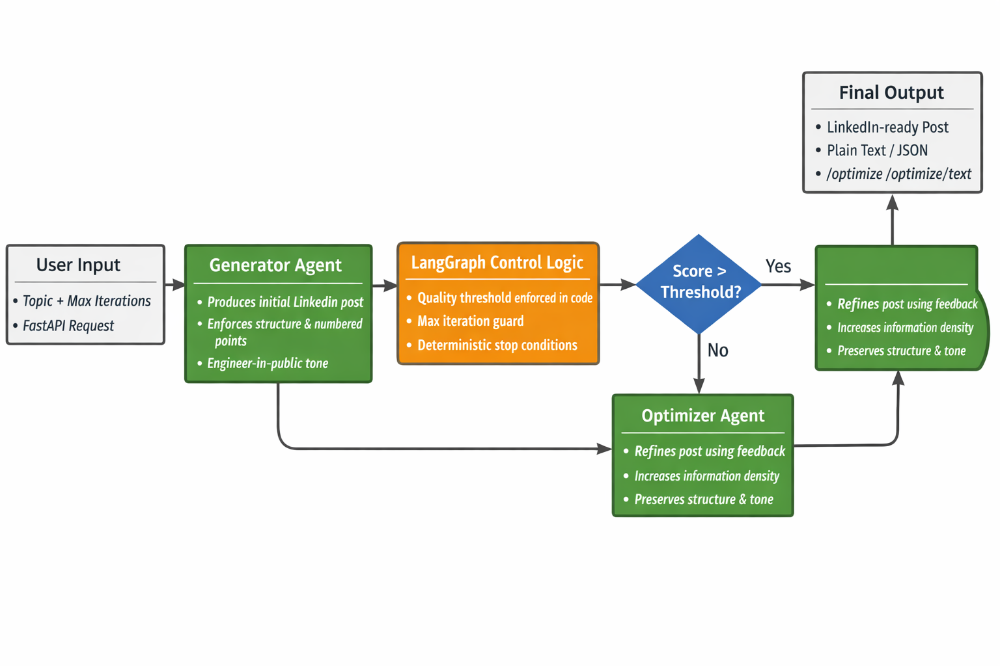

# Agentic LinkedIn Post Optimizer (LangGraph + FastAPI)



This project demonstrates how to turn **manual prompt iteration** into a **deterministic, agentic workflow** using LangGraph and FastAPI.

Instead of repeatedly prompting an LLM to rewrite content, the system:
1. Generates a LinkedIn post
2. Evaluates it using strict, structured criteria
3. Iteratively refines it until it meets a quality threshold or hits a max iteration limit

The focus is **systems and control flow**, not prompt hacking.

---

## Why this project exists

Most AI content workflows look like this:

> Prompt → Rewrite → Rewrite → Rewrite → Accept something mediocre

This repository shows how to replace that loop with:
- Explicit agent roles
- Code-enforced acceptance logic
- Transparent iteration history
- Repeatable, inspectable behavior

The goal is not “better prompts”, but **better loops**.

---

## Repository Structure

```text
agentic-linkedin-post-optimizer/
│
├── app/
│ ├── init.py
│ └── main.py # FastAPI entrypoint
│
├── graph/
│ ├── init.py
│ ├── state.py # Typed agent state
│ └── workflow.py # LangGraph control flow
│
├── prompts/
│ ├── init.py
│ ├── generator.py # Post generation agent
│ ├── evaluator.py # Structured evaluation agent
│ └── optimizer.py # Iterative refinement agent
│
├── models/
│ ├── init.py
│ └── llm_config.py # Model + temperature configuration
│
├── Dockerfile
├── requirements.txt
├── .dockerignore
```

---

## High-Level Architecture


### Flow Overview

1. **Generator Agent**
   - Produces an initial LinkedIn post from a topic
   - Enforces structure: opening line + numbered points

2. **Evaluator Agent**
   - Scores the post on structure, density, and engineering credibility
   - Returns structured feedback (JSON)
   - Does **not** decide acceptance

3. **Optimizer Agent**
   - Refines the post using evaluator feedback
   - Increases information density without bloating length

4. **LangGraph Control Logic**
   - Loops until:
     - Quality score ≥ threshold, or
     - Max iterations reached
   - Prevents infinite loops
   - Keeps state explicit and inspectable

5. **FastAPI Layer**
   - `/optimize` → JSON response (includes history)
   - `/optimize/text` → Plain text, LinkedIn-ready output

---

## Model Configuration & Rationale

This project intentionally uses **different LLMs for different agent roles**.  
Each agent has a distinct responsibility, and model choice is aligned to that responsibility.

The goal is **consistency, control, and cost-awareness**, not using a single model everywhere.

---

### Generator Agent

**Model:** `gpt-4.1`  
**Temperature:** `0.6`

**Why this model?**
- Produces realistic, experience-driven engineering narratives
- Handles strict structural constraints (opening line + numbered points)
- Balances creativity with technical grounding

The generator’s job is to **draft** content that feels like it was written by a senior engineer, not to be perfect.

---

### Evaluator Agent (Most Critical)

**Model:** `gpt-4.1`  
**Temperature:** `0.0`

**Why this model?**
- Highly consistent judgment across iterations
- Strong at structural validation and quality assessment
- Minimizes scoring drift and contradictory feedback

The evaluator **does not decide acceptance**.  
It only scores and critiques — final acceptance is enforced in code.

This separation is intentional and mirrors real production systems.

---

### Optimizer Agent

**Model:** `gpt-4.1-mini`  
**Temperature:** `0.3`

**Why this model?**
- Excellent at constrained rewriting and refinement
- Less prone to hallucinating new ideas
- Significantly cheaper than full-size models

The optimizer improves **density, clarity, and precision** without altering intent or structure.

---

### Why Not Use One Model Everywhere?

Using a single model for all agents often leads to:
- Inconsistent evaluation
- Over-optimization
- Higher costs
- Poor debuggability

By specializing models per role, the system achieves:
- More stable convergence
- Lower overall cost
- Clearer failure modes
- Better alignment with agent responsibilities

---

### Summary Table

| Agent Role | Model | Temperature | Purpose |
|----------|------|------------|--------|
| Generator | `gpt-4.1` | 0.6 | Create structured, realistic drafts |
| Evaluator | `gpt-4.1` | 0.0 | Strict, consistent scoring & feedback |
| Optimizer | `gpt-4.1-mini` | 0.3 | Precise refinement under constraints |

---

**Key Principle:**
> LLMs generate content and opinions.  
> Code enforces control, stopping conditions, and acceptance.
