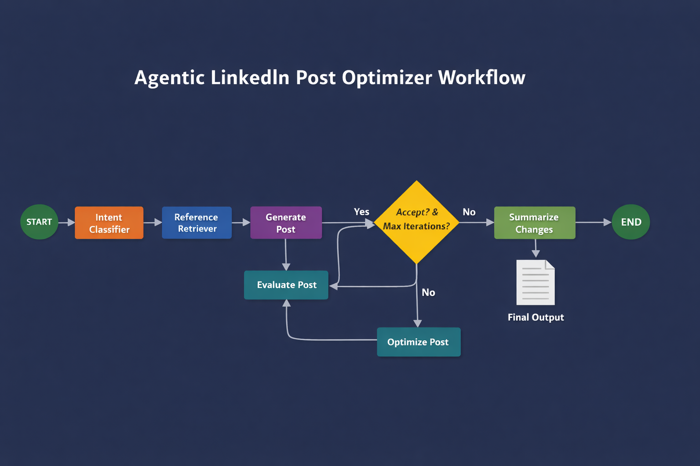

# Agentic LinkedIn Post Optimizer (LangGraph + FastAPI)



This project demonstrates how to turn manual prompt iteration into a deterministic, agentic workflow using LangGraph and FastAPI.

Instead of repeatedly prompting an LLM to rewrite content, the system models writing as a controlled loop with explicit agent roles, clear stopping conditions, and inspectable state.

The focus is systems and control flow, not prompt hacking.

# Agentic LinkedIn Post Optimizer

This repository demonstrates how to replace prompt–rewrite loops with a deterministic, inspectable agentic system for generating and refining LinkedIn posts.

The goal is not better prompts — it is better control loops.

---

## Why This Project Exists

Most AI writing workflows look like this:

Prompt → Rewrite → Rewrite → Rewrite → Accept something mediocre

This project replaces that pattern by moving iteration control into code, not prompts. Writing, evaluation, optimization, stopping, rollback, and summarization are handled by explicit agent roles governed by deterministic rules.

The result is repeatable behavior, predictable convergence, and clear failure modes.

---

## What This System Does

At a high level, the system:

1. Classifies intent (Proof of Work vs Tech Thought Leadership)
2. Grounds generation using intent-aware reference patterns
3. Generates an initial draft using strict intent rules
4. Evaluates the draft using structured, deterministic scoring
5. Optimizes only the weakest dimensions under hard constraints
6. Stops or rolls back based on code-enforced logic
7. Always returns the best iteration, never the last explored one

Acceptance is enforced in code, not by the model.

---

## Core Properties

- Explicit agent roles (writer, evaluator, optimizer, summarizer)
- Intent-aware generation constraints
- Style treated as presentation, not truth
- Frozen focus-factor optimization
- Regression guards and rollback
- Best-iteration guarantee
- Full iteration observability via LangSmith

---

## Repository Structure
```text
agentic-linkedin-post-optimizer/
│
├── app/
│   └── main.py              # FastAPI entrypoint
│
├── graph/
│   ├── state.py             # Typed agent state + best-iteration tracking
│   └── workflow.py          # LangGraph control flow & stop logic
|   └── observability.py     # Tracks LLM Cost per Agent/Node
|   └── costs.py             # Tracks LLM Calls along with Estimated Costs
│
├── prompts/
│   ├── intent_classifier.py # Intent classifier
│   ├── generator.py         # Writer agent
│   ├── evaluator.py         # Editor agent (strict scoring)
│   ├── optimizer.py         # Line editor agent
│   └── summarize_changes.py # Best-iteration-aware summarizer
│
├── models/
│   └── llm_config.py        # Model & temperature configuration
|
│── tests/
│   ├── global_test.py                # Test for best iteration output
│   ├── later_regress_test.py         # Test for later iteration regression
│   ├── no_optimizer_test.py          # Tests for initial score 
│   
├── Dockerfile
├── requirements.txt
```
---

## High-Level Architecture

User Input
↓
Intent Classifier
↓
Reference Grounding (intent-aware)
↓
Generator (Writer)
↓
Evaluator (Editor)
↓
Optimizer (Line Editor)
↓
Code-Enforced Stop / Rollback Logic
↓
Summarizer (best iteration only)
↓
Final LinkedIn Post

---

## Agent Roles

### Generator Agent (Writer)

Responsibilities:
- Drafts the initial LinkedIn post
- Applies intent-specific rules
- Produces claim-driven content (not format-driven)

Proof of Work rules:
- Uses only user-provided facts and metrics
- No invented mechanisms, tools, or numbers
- Allows bounded interpretation
- No forced bullets or point counts

Tech Thought Leadership rules:
- Opinionated, production-grounded reasoning
- No metrics or numbers
- Structured explanations allowed

---

### Communication Style (Presentation Layer)

Style controls how content is written, not what is allowed.

- ENGINEERING_DIRECT — concise, factual
- VIRAL_ENGINEER — scroll-stopping, senior POV
- STORY_DRIVEN — narrative arc, still factual

Truth constraints always dominate style.

---

## Evaluator Agent (Editor)

Responsibilities:
- Scores drafts across fixed dimensions
- Produces structured feedback
- Never decides acceptance
- Runs deterministically (temperature = 0)

Scoring dimensions (0–10):
1. Hook strength
2. Factual grounding
3. Cause → effect clarity
4. Interpretive judgment
5. Information density

The evaluator never sees acceptance thresholds.
All stopping, rollback, and acceptance logic is enforced in code.

---

## Optimizer Agent (Line Editor)

Responsibilities:
- Refines drafts using evaluator feedback
- Improves clarity and density
- Removes redundancy and abstraction
- Preserves all factual constraints

Allowed:
- Merge or remove weak claims
- Reformat structure if clarity improves
- Strengthen interpretation without adding facts

Not allowed:
- Add new facts or metrics
- Reframe intent
- Trade one score for another

---

## Scoring, Optimization & Rollback Strategy

Focus factor selection:
- After first evaluation, the two lowest-scoring dimensions are frozen
- Only these dimensions may be optimized
- A focus factor is removed once it reaches ≥ 8

Early stop:
- If the initial draft scores ≥ 35, optimization is skipped

Regression guards:
- First optimization regression → stop
- Later focus regression → rollback and stop
- Focus flattened + non-focus regression → rollback and stop

Best iteration guarantee:
- Best iteration tracked after every evaluation
- Final output always uses best iteration
- Rollback restores best iteration before summarization

---

## Summarization Semantics

- Summarizes changes between initial and best iteration
- Excludes exploratory or rolled-back drafts
- Never re-evaluates or introduces new claims

---

## LangGraph Control Logic

LangGraph is used to:
- Make state explicit and typed
- Prevent infinite loops
- Enforce stop and rollback rules in code
- Separate decision logic from model behavior

---

## Observability & LangSmith Tracing

Each iteration logs:
- Per-dimension scores
- Focus-factor trajectories
- Score deltas
- Best-iteration deltas
- Rollback events
- Stop reasons

All traces are recorded in LangSmith for inspection.

---

## Model Configuration by Agent Role

### Generator (Writer)
- **Model:** gpt-4.1  
- **Temperature:** 0.6  
- **Purpose:** Draft realistic, senior-engineer content with strong POV and bounded interpretation.

### Evaluator (Editor)
- **Model:** gpt-4.1-mini  
- **Temperature:** 0.0  
- **Purpose:** Strict, deterministic scoring and critique; never decides acceptance.

### Optimizer (Line Editor)
- **Model:** gpt-4o-mini  
- **Temperature:** 0.2–0.3  
- **Purpose:** Constrained refinement of weak dimensions only; improves clarity and density without adding facts.

### Intent Classifier
- **Model:** gpt-4.1-mini  
- **Temperature:** 0.0  
- **Purpose:** Deterministically classify intent (Proof of Work vs Tech Thought Leadership) to enforce downstream constraints.

### Summarizer (Change Summary)
- **Model:** gpt-4.1-mini  
- **Temperature:** 0.0  
- **Purpose:** Explain changes between the initial draft and the best iteration; no re-evaluation or new claims.


Using separate models prevents self-agreeing loops and improves convergence.

---

## FastAPI Interface

POST /optimize  
Returns JSON with final post, scores, iteration count, and change summary

POST /optimize/text  
Returns plain-text, LinkedIn-ready output

---

# Running the Project

This section explains how to run the Agentic LinkedIn Post Optimizer locally or with Docker.  
Both methods expose the same FastAPI endpoints and support full experiment tracking via LangSmith.

---

## Prerequisites

Before running the project, ensure you have:

- **Python 3.10+**
- **An OpenAI API key**
- **Docker** (optional, for containerized runs)
- **A LangSmith account** (optional but recommended for tracing and observability)

---

## Environment Variables

Set the following environment variables before starting the service:

```bash
export OPENAI_API_KEY=sk-xxxx
export LANGSMITH_API_KEY=ls-xxxx
export LANGSMITH_TRACING=true
export LANGSMITH_PROJECT=agentic-linkedin-post-optimizer


Local run:

pip install -r requirements.txt
uvicorn app.main:app --reload
http://localhost:8000/docs

Docker run:

docker build -t agentic-linkedin-post-optimizer .  
docker run -p 8000:8000 \
  -e OPENAI_API_KEY=sk-xxxx \
  -e LANGSMITH_API_KEY=ls-xxxx \
  -e LANGSMITH_TRACING=true \
  -e LANGSMITH_PROJECT=agentic-linkedin-post-optimizer \
  agentic-linkedin-post-optimizer

Azure Login:

az login
az account show

Create Resource Group:

az group create --name rg-agentic-linkedin --location eastus

Create Azure Container Registry (ACR):

az provider register --namespace Microsoft.ContainerRegistry
az acr create \
  --resource-group rg-agentic-linkedin \
  --name agenticacr001 \
  --sku Basic \
  --admin-enabled true

Push Docker Image to ACR:

az acr login --name agenticacr001
docker tag agentic-linkedin-post-optimizer \
  agenticacr001.azurecr.io/agentic-linkedin-post-optimizer:v1
docker push agenticacr001.azurecr.io/agentic-linkedin-post-optimizer:v1

Register Azure Providers (One-Time):

az provider register --namespace Microsoft.App
az provider register --namespace Microsoft.Web
az provider register --namespace Microsoft.OperationalInsights
az provider register --namespace Microsoft.KeyVault


Create Azure Key Vault (RBAC Enabled)

az keyvault create \
  --name agentic-kv-001 \
  --resource-group rg-agentic-linkedin \
  --location eastus \
  --enable-rbac-authorization true

Store Secrets in Key Vault

az keyvault secret set --vault-name agentic-kv-001 --name OPENAI-API-KEY --value sk-xxxx
az keyvault secret set --vault-name agentic-kv-001 --name LANGCHAIN-API-KEY --value ls-xxxx
az keyvault secret set --vault-name agentic-kv-001 --name LANGCHAIN-TRACING-V2 --value true
az keyvault secret set --vault-name agentic-kv-001 --name LANGCHAIN-PROJECT --value agentic-linkedin-post-optimizer

Key Vault secret names use hyphens (-), not underscores.

Create Container Apps Environment:

az containerapp env create \
  --name agentic-env \
  --resource-group rg-agentic-linkedin \
  --location eastus

Deploy Container App:

az containerapp create \
  --name agentic-linkedin-app \
  --resource-group rg-agentic-linkedin \
  --environment agentic-env \
  --image agenticacr001.azurecr.io/agentic-linkedin-post-optimizer:v1 \
  --registry-server agenticacr001.azurecr.io \
  --target-port 8000 \
  --ingress external \
  --min-replicas 0 \
  --max-replicas 1

Get Public URL:

az containerapp show \
  --name agentic-linkedin-app \
  --resource-group rg-agentic-linkedin \
  --query "properties.configuration.ingress.fqdn" \
  --output tsv


Set Environment Variables (Azure Runtime): # Use this only for demos

az containerapp update \
  --name agentic-linkedin-app \
  --resource-group rg-agentic-linkedin \
  --set-env-vars \
    OPENAI_API_KEY=sk-xxxx \
    LANGCHAIN_API_KEY=ls-xxxx \
    LANGCHAIN_TRACING_V2=true \
    LANGCHAIN_PROJECT=agentic-linkedin-post-optimizer

Enable Managed Identity for Container Apps

az containerapp identity assign \
  --name agentic-linkedin-app \
  --resource-group rg-agentic-linkedin \
  --system-assigned

Grant Container App Access to Key Vault

az role assignment create \
  --assignee-object-id <CONTAINER_APP_PRINCIPAL_ID> \
  --assignee-principal-type ServicePrincipal \
  --role "Key Vault Secrets User" \
  --scope /subscriptions/<SUBSCRIPTION_ID>/resourceGroups/rg-agentic-linkedin/providers/Microsoft.KeyVault/vaults/agentic-kv-001

Materialize Key Vault Secrets into Container App Secrets

Azure Container Apps cannot reference Key Vault secrets directly.
Secrets must first be snapshotted into Container App secrets per revision.

az containerapp secret set \
  --name agentic-linkedin-app \
  --resource-group rg-agentic-linkedin \
  --secrets \
    openai-api-key=keyvaultref:https://agentic-kv-001.vault.azure.net/secrets/OPENAI-API-KEY,identityref:system \
    langchain-api-key=keyvaultref:https://agentic-kv-001.vault.azure.net/secrets/LANGCHAIN-API-KEY,identityref:system \
    langchain-tracing-v2=keyvaultref:https://agentic-kv-001.vault.azure.net/secrets/LANGCHAIN-TRACING-V2,identityref:system \
    langchain-project=keyvaultref:https://agentic-kv-001.vault.azure.net/secrets/LANGCHAIN-PROJECT,identityref:system

Bind Environment Variables to Container App Secrets

az containerapp update \
  --name agentic-linkedin-app \
  --resource-group rg-agentic-linkedin \
  --set-env-vars \
    OPENAI_API_KEY=secretref:openai-api-key \
    LANGCHAIN_API_KEY=secretref:langchain-api-key \
    LANGCHAIN_TRACING_V2=secretref:langchain-tracing-v2 \
    LANGCHAIN_PROJECT=secretref:langchain-project

Important: Secret Rotation Model

1) Updating a Key Vault secret does NOT update the running app automatically

2) A new Container App revision is required

3) Re-running az containerapp secret set or any update command triggers a new revision

4) This design ensures deterministic, rollback-safe deployments.


Stop Application (No Compute Cost):

az containerapp ingress disable \
  --name agentic-linkedin-app \
  --resource-group rg-agentic-linkedin

Restart Application:

az containerapp ingress enable \
  --name agentic-linkedin-app \
  --resource-group rg-agentic-linkedin \
  --type external \
  --target-port 8000

Notes

1) Secrets are injected at runtime via Azure Container Apps.

2) No secrets are stored in the image or repository.

3) Scale-to-zero ensures minimal cost when idle.

4) Any code change requires rebuilding and pushing a new Docker image.

```
---

## Summary

This repository shows how to build agentic systems that converge predictably, avoid over-optimization, and expose failure modes clearly by enforcing control logic in code rather than relying on prompt tweaks.


## FASTAPI EndPoint


## ExampleOutput(Virality Post)


## ExampleOutput(Story Driven)
